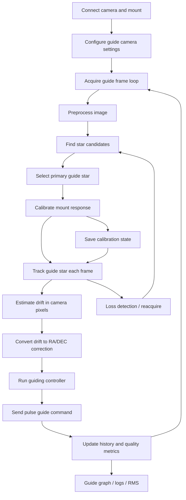

# Internal Guiding Missing Parts

This file lists what is still missing to turn current `lvast` primitives into a fully functional internal guiding system.

Current repo already has some useful building blocks:

- camera pulse guiding capability model in `lvast/src/types/camera.rs`
- mount abstraction in `lvast/src/types/mount.rs`
- image stats, thresholding, histogram, stretch in `lvast/src/algos/images.rs`
- star candidate extraction, blob detection, centroiding, local background, HFR/HFD, ranking in `lvast/src/algos/stars.rs`

What is missing is almost all of guider orchestration, control logic, calibration, temporal state, and runtime integration.

## Pipeline

## Missing Parts

### 1. High-level guider domain types

Missing shared types for:

- guider state machine
- guide session configuration
- calibration result and reuse policy
- guide pulse command abstraction
- drift sample/history
- guide metrics and graph points
- star lock quality / lost-star reason
- multi-star tracking state

Suggested new module:

- `lvast/src/types/guiding.rs`

Suggested core types:

- `VastGuiderState`
- `VastGuideSessionConfig`
- `VastGuideCalibration`
- `VastGuideDriftSample`
- `VastGuideCorrection`
- `VastGuideMetrics`
- `VastGuideStarLock`
- `VastGuideFrameResult`

### 2. High-level guider trait and service

Missing orchestrator trait that ties together:

- guide camera exposure loop
- star acquisition and lock
- calibration
- controller output
- pulse guide dispatch

Suggested module:

- `lvast/src/guiders/mod.rs`
- `lvast/src/guiders/internal.rs`

Suggested trait:

- `VastGuider`

Needed methods:

- `start_guiding(...)`
- `stop_guiding(...)`
- `calibrate(...)`
- `capture_reference_frame(...)`
- `select_guide_star(...)`
- `process_guide_frame(...)`
- `apply_correction(...)`
- `get_metrics(...)`

### 3. Calibration procedure

No mount/camera calibration logic exists yet.

Needed:

- move east/west and north/south with guide pulses
- measure star displacement in pixels
- derive camera angle and axes handedness
- derive ms-per-pixel or arcsec-per-pixel correction gain
- detect backlash and failed axis response
- store calibration and validate reuse conditions

This is one of biggest missing parts.

Without calibration you cannot reliably map pixel drift to RA/DEC corrections.

### 4. Guider control law

No controller exists yet.

Needed:

- proportional controller at minimum
- PI or resist-switch variant for practical guiding
- min-move thresholds
- max pulse durations
- separate RA and DEC aggressiveness
- DEC backlash / one-direction mode
- settle logic after dithering and guide resume

Suggested module:

- `lvast/src/algos/guiding.rs`

Suggested algorithms:

- `compute_guide_correction(...)`
- `update_integrator(...)`
- `apply_min_move(...)`
- `clip_pulse_duration(...)`

### 5. Temporal tracking and lost-star recovery

Current star routines can find stars in one frame, but guider needs cross-frame tracking.

Missing:

- ROI recentering around locked star
- fallback reacquisition in larger search area
- star identity continuity between frames
- lost-star timeout and relock state machine
- star quality trend tracking
- frame rejection when clouds/saturation/bad seeing occur

Future multi-star path should also include:

- reference star set creation
- correspondence matching frame-to-frame
- outlier rejection
- median drift over accepted stars

This is where KStars `guidestars.cpp` ideas become especially relevant.

### 6. Camera acquisition loop for guiding

No internal guider frame loop exists.

Needed:

- repeated short exposures
- optional subframe ROI capture if camera supports ROI
- capture cancellation and timeout handling
- frame timestamping
- dropped-frame handling
- optional dark subtraction / hot-pixel map
- optional binning for guide camera

Also missing camera-side utility methods or wrappers for:

- guide exposure preset profile
- ROI update based on tracked position
- fast frame retrieval loop

### 7. Mount / pulse-guide dispatch integration

There is pulse-guide capability on camera side and mount abstractions exist, but no guider dispatcher.

Needed:

- backend-independent guide output target selection
  - ST4 via camera
  - pulse guiding via mount if later added
- pulse queueing and non-overlap policy
- pulse execution timing and acknowledgment handling
- pause/resume and stop-all behavior

Current `VastMount` trait has no pulse-guide API.

Potential gap:

- either add mount pulse guide methods
- or create guider output trait independent from mount/camera

Suggested trait:

- `VastGuideOutput`

Suggested methods:

- `pulse(direction, duration_ms)`
- `stop_all()`

### 8. SNR, saturation, and validity heuristics

Current star code has simple scoring and useful metrics, but guider-grade validation is still incomplete.

Missing or partial:

- saturation heuristic like PHD2
- stronger SNR estimator
- bad-frame detection from whole-frame statistics
- elongated-star rejection
- mass-change / cloud detection
- centroid shift consistency checks
- false lock rejection

### 9. Guide graph and metrics pipeline

No guide telemetry pipeline exists.

Needed:

- per-frame RA/DEC error samples
- pulse durations and directions
- RMS over time windows
- lost-star events
- SNR / HFR / mass trends
- calibration status and axis angle

Suggested output structures:

- graph samples for UI
- session log rows for disk export

### 10. Dither and settle support

Fully functional guider needs interaction hooks for imaging workflow.

Missing:

- dither request interface
- pixel or arcsec dither target
- pause guiding during dither move
- settle criteria after dither
- resume when drift falls below thresholds for duration window

### 11. Configuration surface

No public guider config exists yet.

Needed settings:

- exposure time
- ROI size
- candidate search limits
- min SNR
- max HFR
- calibration step duration
- RA/DEC aggressiveness
- min move
- max pulse
- backlash settings
- multi-star enable
- lost-star recovery timeout
- dither settle thresholds

### 12. Persistence

No persistence for guider assets exists.

Needed:

- save/load calibration
- save/load guider profiles
- save session logs
- optionally save guide reference star set

Calibration reuse should check:

- mount pier side
- binning
- image scale / focal length
- camera rotation
- guide rate changes

### 13. Concurrency and runtime control

No runtime execution model exists.

Needed:

- worker/task for guider loop
- cancellation tokens
- synchronization with camera and mount operations
- state-safe pause/resume
- prevention of overlapping exposures and guide pulses

### 14. Error handling and recovery

Missing operational recovery policy for:

- no star found
- camera timeout
- mount pulse failure
- calibration axis failure
- clouded frame / low SNR burst
- saturated guide star
- guide star drift outside ROI

Need explicit retry/escalation strategy.

### 15. Internal guider-specific algorithms still worth adding later

Current implementation is a strong base, but future guider will still likely need:

- sigma-clipped annulus background like PHD2
- saturation detection heuristics
- adaptive ROI search and reacquire windows
- multi-star correspondence and outlier rejection
- optional subpixel interpolation refinements
- optional dark/hot-pixel map preprocessing
- optional SEP/StellarSolver detector backend for dense fields

## Current Status By Stage

### Already present

- thresholding primitives
- histogram/statistics primitives
- star candidate preprocessing and PSF-like candidate search
- blob detection
- centroid estimation
- local background estimation
- HFR/HFD estimation
- simple guide-star ranking
- camera pulse-guide capability model

### Partially present

- guide-star acquisition algorithms
- single-frame star quality evaluation

### Missing entirely

- guider orchestrator
- calibration
- controller
- frame loop
- drift history
- pulse dispatch abstraction
- graph/logging pipeline
- dither/settle integration
- persistence
- recovery state machine
- multi-star temporal tracking

## Recommended Implementation Order

1. Add `types/guiding.rs` with shared guider state/config/result types.
2. Add `VastGuideOutput` abstraction for camera ST4 and future mount pulse guiding.
3. Add calibration workflow and persistent calibration result.
4. Add single-star guiding loop with ROI reacquisition.
5. Add controller with RA/DEC tuning, min-move, max-pulse.
6. Add guide graph/log metrics output.
7. Add dither + settle support.
8. Add multi-star tracking/correspondence.
9. Add stronger rejection heuristics and saturation logic.

## Short Summary

Current repo has good low-level image/star primitives for a guider foundation.

What is still missing for a fully functional internal guider is not mostly star math anymore. It is the higher-level guiding system:

- session orchestration
- calibration
- tracking state
- control loop
- pulse dispatch
- persistence
- telemetry
- recovery

That is the real remaining work.
